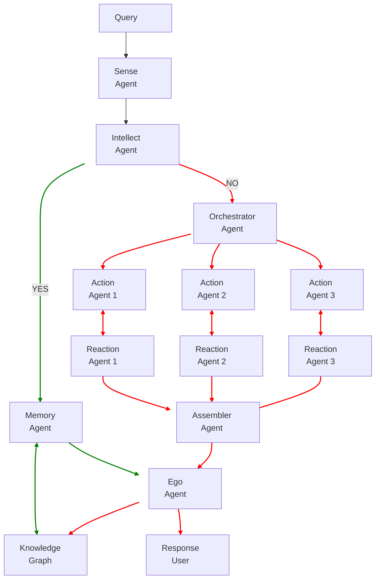

# 🧠 Codebrain

> The Thinking Engine Behind Every Line of Code

**Codebrain** is a brain-inspired multi-agent AI system that solves Python coding interview problems through cognitive simulation. It integrates:
- ✅ LangChain agents for reasoning
- ✅ A knowledge graph memory (Neo4j) for long-term learning
- ✅ Structured output parsing for explainability
- ✅ Dynamic code generation with LLMs

---


## 🚀 Features

- 🧠 **Multi-Agent Architecture**  
  Modeled after human cognitive faculties: Sense, Memory, Intellect, Action, and Ego.

- 📘 **Knowledge Graph Memory**  
  Uses Neo4j to store problems, strategies, concepts, and code interlinked as nodes.

- 🧩 **Modular Strategy Planning**  
  Generates multiple strategy paths and synthesizes Python implementations dynamically.

- 🔁 **Self-Learning Engine**  
  Reinforces and expands its knowledge graph with every new problem.

---

## 📦 Installation

```bash
git clone https://github.com/mindverse-computing/codebrain.git
cd codebrain
pip install -r requirements.txt
```

Then configure your `.env` file:

```bash
cp .env.example .env
```

Add the following keys:

```
OPENAI_API_KEY=your_openai_key
NEO4J_URI=bolt://localhost:7687
NEO4J_USER=neo4j
NEO4J_PASSWORD=yourpassword
```

---

## 🧪 Usage Example

```bash
python examples/solve_problem.py
```

Input:
```
Find the longest increasing subsequence in an array.
```

Output:
- Problem Introduction
- Strategy Options
- Code for Each Strategy
- Selected Best Solution
- Stored to Knowledge Graph

---

## 🧠 Architecture Overview




---

## 📚 Directory Guide

| Folder       | Purpose                          |
|--------------|----------------------------------|
| `agentome/`  | Agent classes & orchestration    |
| `examples/`  | CLI and problem input            |
| `notebooks/` | Jupyter walkthrough     

### Files

```
codebrain/
│
├── README.md                   # Project introduction and usage guide
├── requirements.txt            # Python dependencies
├── .env.example                # Sample env file with API keys
├── .gitignore                  # Ignored files
│
├── agentome/
│   ├── __init__.py
│   ├── base.py                 # Base Agent class
│   ├── sense_agent.py          # Problem comprehension
│   ├── memory_agent.py         # Graph-based memory access
│   ├── intellect_agent.py      # Strategy generation
│   ├── action_agent.py         # Strategy-to-code agent
│   ├── ego_agent.py            # Evaluation & output assembly
│   ├── knowledge_graph.py      # Neo4j connector and logic
│   └── system.py               # Orchestration of agents
│
├── examples/
│   ├── solve_problem.py        # Sample usage script
│   └── problems.txt            # Sample problems for input
│
└── notebooks/
    └── demo.ipynb              # Jupyter notebook walkthrough


```         

---

## 🛠️ Tech Stack

- [LangChain](https://github.com/hwchase17/langchain)
- [Neo4j](https://neo4j.com/)
- [OpenAI GPT-4](https://platform.openai.com/)
- [Python 3.9+](https://www.python.org/)

---

## 📈 Future Directions

- ✅ LangGraph integration for visual state workflows
- ✅ Curriculum Agent for guided learning
- ✅ UI for interactive graph-based reasoning
- ✅ Auto-evaluator with test case verification

---

## 🤝 Contributing

Pull requests are welcome! For major changes, open an issue first.

---

## 📄 License

MIT © 2025 Mindverse Computing

---

## 🌐 Project Status

Actively developed. Reach out to `@mindverse` to collaborate! 

-------

# Join Us

Join our slack channel: [bit.ly/mc-slack](bit.ly/mc-slack)
